# Multi-Article Blueprint Dependency DAG

Generated by **SocrateAI Multi-Article Blueprint Generator**.
Articles covered: `Paper_I_Mathematical_Foundations.tex, Paper_II_Cosmological_Phenomenology.tex, Paper_III_Particle_Physics_Applications.tex, Gravitational_Waves_K4_Hypergraph.tex, quantumfluids_tdual.tex, Density_Activated_Chameleon_Gravity.tex, Extremal_Level12_EtaQuotient.tex, Lean4_GL2_Poincare.tex`

```mermaid
graph TD
    subgraph Quarantined_Axioms [Quarantined Physics Postulates]
        A1["Tadpole Cancellation (Paper 1)"]:::axiomStyle
        A2["Swampland SDC Bound (Paper 1)"]:::axiomStyle
        A3["Gromov-Hausdorff Continuum (Paper 2)"]:::axiomStyle
        A4["Dispersive Cascade Regularity (Paper 3)"]:::axiomStyle
        A5["Thin-Shell Chameleon Screening (DAC)"]:::axiomStyle
    end

    subgraph Theory_1_String_Compactifications [String Theory on K3 x T2]
        S1["k3_euler_char_eq_24 (chi=24)"]:::provenStyle
        S2["picard_bound (rho <= 20)"]:::provenStyle
        S3["k3t2_euler_char_eq_zero (chi=0)"]:::provenStyle
        S4["k3_parity_modulo_8 (Gamma 3,19)"]:::provenStyle
        S5["mathieu_rigidity_ratio (R_NL = 77/60)"]:::provenStyle
    end

    subgraph Theory_2_Pregeometry_Gravitational_Waves [K4 Hypergraph Pregeometry]
        P1["k4_handshaking (2E = 12)"]:::provenStyle
        P2["k4_adjacency_trace_zero (Tr=0)"]:::provenStyle
        P3["k4_spectral_gap_eq_four (Gap=4)"]:::provenStyle
        P4["orf_suppression_exact (1/144)"]:::provenStyle
    end

    subgraph Theory_3_Quantum_Information [Quantum & M24 Error Correction]
        Q1["golay_corrects_three_errors (t=3)"]:::provenStyle
        Q2["fock_space_dim_eq_4096 (2^12)"]:::provenStyle
        Q3["m24_order_factored (|M24|=244M)"]:::provenStyle
    end

    subgraph Theory_4_Phenomenology [Inflation, Cosmology & Modified Gravity]
        PH1["efolds_squared_eq_3025 (r=12/3025)"]:::provenStyle
        PH2["ns_numerator_eq_53 (ns=53/55)"]:::provenStyle
        PH3["prior_sensitivity_opposition (ln B)"]:::provenStyle
        PH4["k3t2_chi2_below_unity (chi2=0.765)"]:::provenStyle
        PH5["dac_regime_I_fifth_force_zero (DF2)"]:::provenStyle
        PH6["dac_below_cassini (PPN<2.3e-5)"]:::provenStyle
    end

    subgraph Paper_Target_Theorems [Target Research Syntheses]
        T_STRING["Paper 1: Moduli & Swampland Concordance"]:::targetStyle
        T_GW["Paper 2: NANOGrav Anisotropy & SGWB Index"]:::targetStyle
        T_QEC["Paper 3: Topological Error Resilience"]:::targetStyle
        T_DAC["DAC: Inverted Symmetron DF2 / Solar System"]:::targetStyle
    end

    A1 -.-> T_STRING
    A2 -.-> T_STRING
    S1 --> T_STRING
    S2 --> T_STRING
    S3 --> T_STRING
    S4 --> T_STRING
    S5 --> T_STRING
    PH1 --> T_STRING
    PH2 --> T_STRING

    A3 -.-> T_GW
    P1 --> T_GW
    P2 --> T_GW
    P3 --> T_GW
    P4 --> T_GW
    PH3 --> T_GW
    PH4 --> T_GW

    A4 -.-> T_QEC
    Q1 --> T_QEC
    Q2 --> T_QEC
    Q3 --> T_QEC

    A5 -.-> T_DAC
    PH5 --> T_DAC
    PH6 --> T_DAC

    classDef axiomStyle fill:#ffdddd,stroke:#cc0000,stroke-dasharray: 5 5,color:#990000;
    classDef provenStyle fill:#ddffdd,stroke:#00aa00,stroke-width:2px,color:#006600;
    classDef targetStyle fill:#e6f2ff,stroke:#0066cc,stroke-width:3px,color:#003366;
```

### Legend
- **Green solid boxes**: Formally verified constructive theorems (`rfl`, `decide`, 0 axioms).
- **Red dashed boxes**: Quarantined physical heuristics (`axiom` / `variable`).
- **Blue thick boxes**: Synthesis targets for each peer-reviewed paper.
