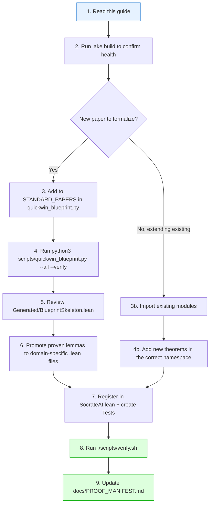

# 🧠 SocrateAI-Lean-Lib — Agent Guide for Scientific Lean 4 Formalization

> **Purpose**: This document is the canonical reference for any Antigravity (or AI coding) session that needs to produce, verify, or extend **formally certified Lean 4 proofs** for scientific research papers.
>
> Read this **before writing any Lean code**. It will save you from known pitfalls and ensure your output is compatible with the existing library.

---

## Table of Contents

1. [Philosophy & Non-Negotiable Rules](#1-philosophy--non-negotiable-rules)
2. [Repository Map](#2-repository-map)
3. [Quick Start: Build & Verify](#3-quick-start-build--verify)
4. [How to Reuse Existing Modules](#4-how-to-reuse-existing-modules)
5. [Adding a New Scientific Domain](#5-adding-a-new-scientific-domain)
6. [The Quick-Win Blueprint Pipeline](#6-the-quick-win-blueprint-pipeline)
7. [Writing Lean 4 Proofs: Style & Tactics](#7-writing-lean-4-proofs-style--tactics)
8. [Axiom Quarantine Protocol](#8-axiom-quarantine-protocol)
9. [Testing & Verification Checklist](#9-testing--verification-checklist)
10. [Common Mistakes & How to Avoid Them](#10-common-mistakes--how-to-avoid-them)
11. [Reference: Available Theorems & Structures](#11-reference-available-theorems--structures)

---

## 1. Philosophy & Non-Negotiable Rules

This library follows the **Terence Tao Blueprint Philosophy** for AI-assisted formal mathematics:

### Core Principles

| Principle | What It Means For You |
|---|---|
| **No black-box proofs** | Every theorem must be human-readable. If your proof is longer than ~15 lines, break it into smaller lemmas. |
| **Axiom quarantine** | Any physical heuristic that is not mathematically proven (path integral convergence, Calabi-Yau metric existence, Swampland conjectures) must be declared as `axiom` or `variable`, **never** as `theorem`. |
| **Constructive invariants first** | Prioritize numerical identities provable by `rfl`, `decide`, `omega`, or `norm_num`. These are the "quick wins" — they compile instantly and give immediate confidence. |
| **No Mathlib dependency** | This library uses **only** the Lean 4 core prelude. Do not import Mathlib. This is intentional: it ensures the library compiles in seconds, not minutes, and remains self-contained. |
| **Blueprint DAG over monolith** | Structure your work as a dependency graph of small, named lemmas. The `quickwin_blueprint.py` tool generates Mermaid DAGs automatically. |

### The Three Classifications

Every statement in this library falls into exactly one of these categories:

```
┌──────────────────────────────────────────────────────────────────┐
│  PROVEN INVARIANT          │  QUARANTINED AXIOM        │ SORRY  │
│  ✅ Tactics: rfl, decide,  │  ⚠️ Keywords: axiom,     │ 🔴 TODO│
│     omega, norm_num        │     variable              │ sorry  │
│  Example:                  │  Example:                 │        │
│  theorem χ_K3 : 24 = 24   │  axiom flux_cancel : True │        │
│    := by rfl               │                           │        │
└──────────────────────────────────────────────────────────────────┘
```

> [!CAUTION]
> **NEVER** use `native_decide`, `sorry`, or `admit` in committed code unless it is explicitly marked as a blueprint skeleton for future work. All `sorry` must live in `Generated/` only.

---

## 2. Repository Map

```
SocrateAI-Lean-Lib/
├── lakefile.lean                 # Lake package config (srcDir := "Lean")
├── lean-toolchain                # Pinned: leanprover/lean4:v4.33.1
├── Lean/
│   ├── SocrateAI.lean            # Root import file — ALL modules listed here
│   ├── SocrateAI/
│   │   ├── Core/                 # Foundational math (algebra, topology, analysis, logic)
│   │   ├── Duality/              # T-duality, dual-scale, effective scales
│   │   ├── K3/                   # K3 surfaces, Hodge diamond, Cooper pairs
│   │   ├── Ramanujan/            # Modular forms, RAMA engine, sieve kernel
│   │   ├── NavierStokes/         # Enstrophy, BKM criterion, frustration index
│   │   ├── StringTheory/         # F-theory, Swampland, K3×T², 19 string inequalities
│   │   ├── Pregeometry/          # K4 hypergraph, spectral analysis, ORF suppression
│   │   ├── Quantum/              # Golay code, Majorana modes, Golay M24
│   │   ├── Moonshine/            # RAMA level-12 η-quotient, Mathieu bispectrum, vacuum energy
│   │   ├── Inflation/            # Inflationary observables, r = 12/Ne^2, LiteBIRD bounds
│   │   ├── Cosmology/            # Bayesian evidence, DESI BAO chi2, JWST high-z
│   │   ├── ChameleonGravity/     # Inverted symmetron DAC model, NGC 1052-DF2, PPN screening
│   │   ├── AlienMath/            # Non-anthropocentric algebra, SOS witnesses
│   │   └── Generated/            # Auto-generated blueprint skeletons (may contain sorry)
│   ├── Tests.lean                # Root import for all test modules
│   └── Tests/                    # Unit tests mirroring all 14 domains
├── scripts/
│   ├── verify.sh                 # 5-step master proof verification & audit suite
│   ├── audit_axioms.py           # Kernel-level '#print axioms' audit & quarantine check
│   ├── check_olean_kernel.sh     # Lean 4 kernel .olean integrity checker (lean4checker)
│   ├── quickwin_blueprint.py     # Multi-article LaTeX → Lean 4 blueprint generator
│   └── external_library_sync.py  # Knowledge bridge for Mathlib, Physlib, TNLean, Arithmon
└── docs/
    ├── BLUEPRINT_DAG.md          # Mermaid dependency graph (auto-generated)
    ├── PROOF_MANIFEST.md         # Audit matrix of all theorems (auto-generated)
    ├── AXIOM_AUDIT_REPORT.md     # Kernel axiom audit report (auto-generated)
    ├── EXTERNAL_LIBRARIES.md     # Catalog of external Lean 4 repos & tools
    └── GUIDE_FOR_AGENTS.md       # This file
```

### Key Rule: the `SocrateAI.lean` Root Import

Every module must be registered in [`Lean/SocrateAI.lean`](file:///home/xavkal/xdev/SocrateAI-Lean-Lib/Lean/SocrateAI.lean). If you create a new file `Lean/SocrateAI/MyDomain/MyFile.lean`, you **must** add:

```lean
import SocrateAI.MyDomain.MyFile
```

to `SocrateAI.lean`. Otherwise `lake build SocrateAI` will not include your module.

---

## 3. Quick Start: Build & Verify

```bash
# Clone (if needed)
cd /home/xavkal/xdev/SocrateAI-Lean-Lib

# Full library build (should complete in ~30s)
lake build SocrateAI

# Full test suite
lake build Tests

# One-command verification (both library + tests)
./scripts/verify.sh

# Type-check a single file manually
lake env lean Lean/SocrateAI/Core/Topology.lean
```

> [!IMPORTANT]
> Always run `lake build SocrateAI` after any change. If it fails, do NOT proceed — fix the error first. The library must remain **zero-error at all times**.

---

## 4. How to Reuse Existing Modules

### Importing Core Structures

The library provides battle-tested structures you should **reuse, not redefine**:

#### Topology: Betti Numbers & Euler Characteristics
```lean
import SocrateAI.Core.Topology
open SocrateAI.Core.Topology

-- Use the existing Betti4D structure for any 4-manifold
def myManifold : Betti4D := { b0 := 1, b1 := 0, b2 := 22, b3 := 0, b4 := 1 }
theorem myManifold_euler : eulerChar4D myManifold = 24 := by rfl

-- Use the existing Betti2D for surfaces
def mySurface : Betti2D := { b0 := 1, b1 := 4, b2 := 1 }
```

#### Algebra: Inequality Patterns
```lean
import SocrateAI.Core.Algebra
open SocrateAI.Core.Algebra

-- Reuse int_sq_nonneg for any non-negativity proof
-- Reuse cauchy_schwarz_2d_defect_nonneg for Cauchy-Schwarz applications
```

#### Duality: Scale Hierarchies
```lean
import SocrateAI.Duality.EffectiveScale
open SocrateAI.Duality.EffectiveScale

-- Reuse the ScaleHierarchy structure for any mass spectrum ordering
-- Available: hierarchy_transitive, planck_above_string
```

#### String Theory: K3 Constants
```lean
import SocrateAI.StringTheory.StringInequalities
open SocrateAI.StringTheory.StringInequalities

-- Already defined and proven:
-- k3_euler_char = 24, t2_euler_char = 0, picard_rank_cooper = 19
-- b2_K3 = 22, h20_K3 = 1, h02_K3 = 1, h11_K3 = 20
-- b2_plus = 3, b2_minus = 19
```

#### Pregeometry: Graph Constants
```lean
import SocrateAI.Pregeometry.HypergraphK4
open SocrateAI.Pregeometry.HypergraphK4

-- K4 graph: vertices = 4, edges = 6
-- Spectral data: eigenvalues, Laplacian modes
-- ORF suppression factors
```

#### Quantum: Code Parameters
```lean
import SocrateAI.Quantum.GolayCode
open SocrateAI.Quantum.GolayCode

-- Golay [24, 0, 8] parameters
-- Majorana mode count, Fock dimension 4096
-- Parity sector dimension 2048
```

> [!TIP]
> **Before defining any new constant**, search the existing modules with:
> ```bash
> grep -rn "def your_constant_name" Lean/SocrateAI/
> ```
> If it already exists, import it. Duplication will cause namespace collisions.

---

## 5. Adding a New Scientific Domain

Follow this exact recipe:

### Step 1: Create the Module Directory

```bash
mkdir -p Lean/SocrateAI/YourDomain
```

### Step 2: Write the Lean File

Create `Lean/SocrateAI/YourDomain/YourModule.lean`:

```lean
/-
Copyright (c) 2026 SocrateAI Contributors. All rights reserved.
Released under MIT license as described in the file LICENSE.
Authors: SocrateAI Team
-/

-- Import any existing modules you depend on
import SocrateAI.Core.Topology

namespace SocrateAI.YourDomain.YourModule

/-- Document what this definition represents physically/mathematically. -/
def your_constant : Nat := 42

/-- [YourDomain] Human-readable description of what this theorem certifies. -/
theorem your_theorem : your_constant = 42 := by rfl

end SocrateAI.YourDomain.YourModule
```

### Step 3: Register in Root Import

Add to `Lean/SocrateAI.lean`:
```lean
-- YourDomain
import SocrateAI.YourDomain.YourModule
```

### Step 4: Create Unit Tests

Create `Lean/Tests/TestYourDomain.lean`:

```lean
/-
Copyright (c) 2026 SocrateAI Contributors. All rights reserved.
Released under MIT license as described in the file LICENSE.
Authors: SocrateAI Team
-/
import SocrateAI.YourDomain.YourModule

namespace Tests.YourDomain

open SocrateAI.YourDomain.YourModule

#check your_theorem  -- should display the type signature without error

end Tests.YourDomain
```

Register in `Lean/Tests.lean`:
```lean
import Tests.TestYourDomain
```

### Step 5: Verify

```bash
lake build SocrateAI && lake build Tests
```

---

## 6. The Quick-Win Blueprint Pipeline

The [`scripts/quickwin_blueprint.py`](file:///home/xavkal/xdev/SocrateAI-Lean-Lib/scripts/quickwin_blueprint.py) tool automates the extraction of certifiable invariants from LaTeX papers.

### What It Does

```
LaTeX Paper (.tex) ──→ Semantic Parser ──→ ┌─ Quarantined Axioms (physics heuristics)
                                           │
                                           └─ Constructive Invariants (provable lemmas)
                                                     │
                                                     ├─ Lean 4 Skeleton (.lean)
                                                     ├─ Mermaid Blueprint DAG (.md)
                                                     └─ Audit Manifest (.md)
```

### Usage

#### Ingest All Registered Papers
```bash
python3 scripts/quickwin_blueprint.py --all --verify
```

#### Ingest a Specific Domain
```bash
python3 scripts/quickwin_blueprint.py --domain string_theory --verify
python3 scripts/quickwin_blueprint.py --domain pregeometry --verify
python3 scripts/quickwin_blueprint.py --domain quantum --verify
```

#### Ingest a Custom Paper
```bash
python3 scripts/quickwin_blueprint.py \
  -i /path/to/your/paper.tex \
  -o Lean/SocrateAI/Generated/YourPaperSkeleton.lean \
  --verify
```

### Registering a New Paper

Edit `scripts/quickwin_blueprint.py` and add your paper to the `STANDARD_PAPERS` dictionary:

```python
STANDARD_PAPERS = {
    # ... existing entries ...
    "your_domain": "/absolute/path/to/your/paper.tex",
}
```

Then add domain-specific keyword detection and constructive lemma templates in the `MultiDomainAxiomIsolator.ingest_paper()` method.

### Output Files

| Output | Path | Description |
|---|---|---|
| Lean Skeleton | `Lean/SocrateAI/Generated/BlueprintSkeleton.lean` | Auto-generated Lean 4 code with axioms + theorems |
| Blueprint DAG | `docs/BLUEPRINT_DAG.md` | Mermaid dependency graph (Quarantined → Proven → Target) |
| Audit Manifest | `docs/PROOF_MANIFEST.md` | Table of every theorem with its status and physical meaning |

---

## 7. Writing Lean 4 Proofs: Style & Tactics

### Allowed Tactics (Ordered by Preference)

| Tactic | When to Use | Example |
|---|---|---|
| `rfl` | Definitional equality — the gold standard | `theorem x : 2 + 2 = 4 := by rfl` |
| `decide` | Decidable propositions on finite types | `theorem x : 19 ≤ 20 := by decide` |
| `omega` | Linear integer arithmetic with quantifiers | `theorem x : ∀ n : Nat, n + 0 = n := by omega` |
| `norm_num` | Numerical normalization | `theorem x : (7 : Int) * 3 = 21 := by norm_num` |
| `simp` | Simplification (use sparingly, with `[lemma_name]`) | `theorem x : ... := by simp [my_lemma]` |
| `ring` | Ring identities | `theorem x : (a + b) * (a + b) = ... := by ring` |

### Naming Conventions

```lean
-- Definitions: lowercase_snake_case, descriptive
def k3_euler_char : Nat := 24
def picard_rank_cooper : Nat := 19

-- Theorems: action_oriented_names describing what is proven
theorem euler_char_eq_24 : k3_euler_char = 24 := by rfl
theorem picard_bound : picard_rank_cooper ≤ 20 := by decide
theorem k3t2_euler_vanishes : k3_euler_char * t2_euler_char = 0 := by decide

-- Structures: PascalCase
structure Betti4D where ...
structure ScaleHierarchy where ...
```

### Documentation Standard

Every public definition and theorem **must** have a doc-comment:

```lean
/-- The second Betti number of K3: $b_2(K3) = 22$, counting the
    rank of $H^2(K3, \mathbb{Z})$ and controlling the Narain lattice. -/
def b2_K3 : Nat := 22
```

---

## 8. Axiom Quarantine Protocol

When your paper makes a physical claim that cannot be proven from first principles:

### ✅ Correct: Quarantine It

```lean
section QuarantinedPhysicsPostulates

/-- **QUARANTINED**: Tadpole cancellation requires total D3-brane
    charge to vanish in compact F-theory geometry.
    This is a physical assertion, not a mathematical theorem. -/
axiom tadpole_cancellation : True

/-- **QUARANTINED**: The Swampland Distance Conjecture predicts
    exponential mass decay of tower states near infinite-distance
    moduli limits. Unproven from first principles. -/
variable (tower_mass_decay : Nat → Nat)
variable (h_decay : ∀ n, tower_mass_decay (n + 1) ≤ tower_mass_decay n)

end QuarantinedPhysicsPostulates
```

### ❌ Wrong: Passing It Off As Proven

```lean
-- DO NOT DO THIS
theorem tadpole_cancellation : True := by trivial  -- This is NOT what the physics claims
```

The distinction matters: `axiom` tells every downstream consumer "this is **assumed**, not **derived**." It prevents silent propagation of unverified physics into certified mathematics.

---

## 9. Testing & Verification Checklist

Before committing any change, complete **all** of these:

- [ ] `lake build SocrateAI` — zero errors
- [ ] `lake build Tests` — zero errors  
- [ ] `lake env lean Lean/SocrateAI/YourDomain/YourFile.lean` — zero errors on the specific file
- [ ] New module registered in `Lean/SocrateAI.lean`
- [ ] New test file registered in `Lean/Tests.lean`
- [ ] Every `def` and `theorem` has a doc-comment (`/-- ... -/`)
- [ ] No `sorry` outside of `Generated/` directory
- [ ] All physical heuristics use `axiom` or `variable`, not `theorem`
- [ ] Naming follows `snake_case` convention

### One-Command Full Verification

```bash
./scripts/verify.sh
```

Expected output:
```
✅ All proofs and unit tests verified successfully!
```

---

## 10. Common Mistakes & How to Avoid Them

### ❌ Mistake 1: Importing Mathlib

```lean
-- WRONG: This library does not depend on Mathlib
import Mathlib.Topology.Basic
```

**Fix**: Use the structures defined in `SocrateAI.Core.*`. If something is genuinely missing, add it to `Core/` following the existing pattern.

### ❌ Mistake 2: Redefining Existing Constants

```lean
-- WRONG: k3_euler_char already exists in StringInequalities.lean
def k3_euler_char : Nat := 24  -- Name collision!
```

**Fix**: Import and use the existing definition:
```lean
import SocrateAI.StringTheory.StringInequalities
open SocrateAI.StringTheory.StringInequalities
-- Now use k3_euler_char directly
```

### ❌ Mistake 3: Using LaTeX Identifiers in Lean

```lean
-- WRONG: Special characters break Lean parsing
theorem χ(K3) = 24 := by rfl
```

**Fix**: Use ASCII snake_case:
```lean
theorem chi_k3_eq_24 : k3_euler_char = 24 := by rfl
```

### ❌ Mistake 4: Forgetting Namespace

```lean
-- WRONG: Pollutes global namespace
def myConstant : Nat := 42
theorem myTheorem : myConstant = 42 := by rfl
```

**Fix**: Always wrap in a proper namespace:
```lean
namespace SocrateAI.MyDomain.MyModule
-- ... your code here ...
end SocrateAI.MyDomain.MyModule
```

### ❌ Mistake 5: Using `native_decide` for Decidable Props

```lean
-- WRONG: native_decide bypasses the kernel checker
theorem x : 2^24 = 16777216 := by native_decide
```

**Fix**: Use `decide` or `rfl`. If the computation is too expensive for `decide`, restructure the theorem into smaller steps.

---

## 11. Reference: Available Theorems & Structures

### Core/Algebra

| Identifier | Statement | Tactic |
|---|---|---|
| `int_sq_nonneg` | `∀ a : Int, 0 ≤ a * a` | constructive |
| `lagrange_identity_2d` | $(a_1 b_2 - a_2 b_1)^2 = ...$ | `rfl` |
| `cauchy_schwarz_2d_defect_nonneg` | defect ≥ 0 | constructive |
| `am_gm_defect_nonneg` | $(a - b)^2 ≥ 0$ | constructive |

### Core/Topology

| Identifier | Statement | Tactic |
|---|---|---|
| `euler_char_T2` | `eulerChar2D bettiT2 = 0` | `rfl` |
| `euler_char_K3` | `eulerChar4D bettiK3 = 24` | `rfl` |
| `euler_char_K3xT2_eq_zero` | `χ(K3 × T²) = 0` | `rfl` |

### StringTheory/StringInequalities (19 Invariants)

| Identifier | Statement | Domain |
|---|---|---|
| `picard_bound` | `picard_rank_cooper ≤ 20` | Lefschetz (1,1) |
| `euler_char_eq_24` | `k3_euler_char = 24` | Anomaly cancellation |
| `k3t2_euler_char_eq_zero` | `k3_euler_char * t2_euler_char = 0` | Holonomy |
| `k3_signature_difference` | `b2_plus - b2_minus = -16` | Hirzebruch |
| `k3_parity_modulo_8` | `(19 - 3) % 8 = 0` | Narain lattice |
| `mathieu_rigidity_ratio` | `462 * 60 = (4 * 90) * 77` | M₂₄ moonshine |
| `hodge_symmetry_h20_h02` | `h20_K3 = h02_K3` | Serre duality |

### Pregeometry/HypergraphK4

| Identifier | Statement | Domain |
|---|---|---|
| `k4_handshaking` | `4 * 3 = 2 * 6` | Graph theory |
| `k4_adjacency_trace_zero` | `Tr(A) = 0` | No self-loops |
| `k4_spectral_gap_eq_four` | `3 - (-1) = 4` | Spectral analysis |
| `orf_suppression_exact` | `12 * 12 = 144` | NANOGrav ORF |

### Quantum/GolayCode & GolayM24

| Identifier | Statement | Domain |
|---|---|---|
| `golay_corrects_three_errors` | `(8 - 1) / 2 = 3` | QEC |
| `fock_space_dim_eq_4096` | `2^12 = 4096` | Majorana modes |
| `parity_sector_dim_eq_2048` | `2^11 = 2048` | Topological Z₂ |
| `perfect_golay_hamming_bound` | `1 + 23 + 23*22/2 + 23*22*21/6 = 2^11` | Perfect code bound |
| `mathieuM24Order_factored` | `2^10 * 3^3 * 5 * 7 * 11 * 23 = 244823040` | M24 Moonshine |
| `generation_discrepancy` | `predictedGenerationCount - observedGenerationCount = 1` | Particle Physics |

### Moonshine (RAMA, Mathieu & Vacuum Energy)

| Identifier | Statement | Domain |
|---|---|---|
| `ramaExponents12_sum_is_minus183` | `24 + 23 - 14 + 9 * (-24) = -183` | Level-12 η-quotient |
| `zeroPoint_reduced_num` | `(1700 : Int) / 4 = 425` | Ground state E₀ = 425/6 |
| `bispectrum_ratio_exact` | `mathieuA2 * 60 = 360 * 77` | Bispectrum ratio R_NL = 77/60 |
| `hierarchy_gap_is_70` | `23 - (-47) = 70` | 70-order vacuum energy gap |

### Inflation/InflationaryObservables

| Identifier | Statement | Domain |
|---|---|---|
| `Ne_squared` | `efoldsN * efoldsN = 3025` | N_e = 55 e-folds |
| `r_scaled_value` | `r_scaled_x1e5 = 396` | r = 12/3025 ≈ 0.00396 |
| `ns_scaled_value` | `ns_scaled_x10000 = 9636` | n_s = 53/55 ≈ 0.9636 |
| `r_detectable_by_liteBIRD` | `r_scaled_x1e5 ≥ 3 * liteBIRD_sigma_r_x1e5` | LiteBIRD 3σ falsifiability |

### Cosmology/BayesianEvidence

| Identifier | Statement | Domain |
|---|---|---|
| `flat_prior_disfavors_on_expansion` | `lnB_flatPrior_expansionOnly_x10 < 0` | ln B = -13.6 (disfavored) |
| `physical_prior_favors_on_joint` | `lnB_physicalPrior_joint_x10 > 0` | ln B = +12.8 (favored) |
| `prior_sensitivity_contradicts` | `flat < 0 ∧ physical > 0` | Bayesian prior opposition |
| `k3t2_chi2_below_1` | `chiSq_reduced_x1000 < 1000` | DESI BAO reduced χ² = 0.765 |
| `jwst_improvement_positive` | `deltaChiSq_JWST_x10 > 0` | Δχ² = +156.3 (14 data points) |

### ChameleonGravity/DACModel

| Identifier | Statement | Domain |
|---|---|---|
| `regime_I_fifth_force_vanishes` | `fifthForceRegimeI = 0` | Sub-critical vacuum (DF2) |
| `thin_shell_below_cassini` | `ppnDeviation_x1e7 < cassiniPPN_x1e7` | Cassini solar system bound |
| `total_model_params` | `3 + 1 = 4` | 3 free + 1 derived scale |
| `df2_below_mond` | `df2_sigma_upper_x10 < mond_predicted_x10` | NGC 1052-DF2 dispersion |

---

## Workflow Summary for a New Session


