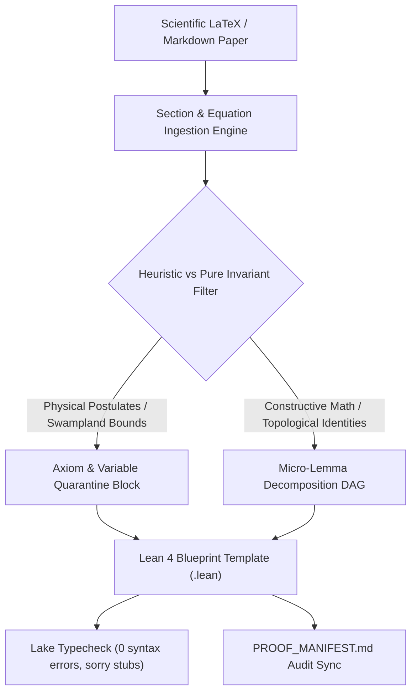

To build a state-of-the-art ecosystem for formalizing advanced scientific theories (such as Quantum Mechanics, String Theory, and K3 Surfaces) in Lean 4, we must bridge the immense gap between informal physics heuristics and rigorous formal mathematics.

Fields Medalist **Terence Tao** has heavily advocated for integrating AI into Lean 4 via **"vibe coding"** and **blueprinting**. However, Tao explicitly warns against AI acting as a black-box oracle that generates unreadable "million-line" proof scripts. For Tao, the purpose of a formal proof is not just absolute verification, but to **communicate ideas, modularize concepts, and extract mathematical beauty**. Furthermore, he notes that AI often gets trapped in narrow logic loops when left unsupervised.

To respect and *improve upon* Tao’s recommendations for AI proof submission, we propose a state-of-the-art **Neuro-Symbolic Toolchain** and a **5-Step Standard Operating Procedure (SOP)** that integrates **LEAP**, **Mistral's Leanstral 1.5**, **DeepSeek-Prover-V1.5**, and large-scale GitHub repositories.

---

### Part 1: The AI Toolchain Architecture

Rather than relying on a single monolithic LLM, this architecture assigns specialized models to the tasks they were uniquely engineered for:

1. **The Context & Engineering Engine: Leanstral 1.5 (Mistral's Lean Model)**
* **Role:** Repository-level semantic mapping and proof refactoring.
* **Capability:** With a massive 256k context window, Leanstral 1.5 is designed for proof engineering in realistic, pre-existing repositories. It prevents the AI from hallucinating redundant mathematical structures by grounding it in existing mathbases.

2. **The Orchestrator: LEAP (LLM-in-Lean Environment Agentic Prover)**
* **Role:** High-level blueprinting and dynamic Directed Acyclic Graph (DAG) generation.
* **Capability:** LEAP acts as the project manager. It translates an informal scientific paper into an AND-OR graph of intermediate lemmas populated with `sorry` placeholders, recursively breaking down complex goals.

3. **The Tactic Engine: DeepSeek-Prover-V1.5 (Deep Lean Prover)**
* **Role:** Brute-force local theorem proving.
* **Capability:** Using Reinforcement Learning from Proof Assistant Feedback (RLPAF) and its intrinsic Monte-Carlo Tree Search (RMaxTS), this prover excels at finding diverse proof paths and escaping logical dead-ends for isolated tactical goals.

4. **The Knowledge Base: Scientific GitHub Repositories (RAG)**
* **Role:** Ontological grounding via Retrieval-Augmented Generation.
* **Resources Used:** `mathlib4` (pure math), `leanprover-community/physlib` (general physics), `TNLean` (Tensor Networks and Quantum bounds), and `Arithmon` (K3 surfaces and Calabi-Yau volume bounds).

---

### Part 2: The 5-Step Procedure for Scientific Proof Submission

This pipeline transitions the AI from a simple "tactic guesser" into a domain-aware scientific collaborator.

#### Step 1: Semantic Ingestion and Axiom Isolation (Leanstral 1.5)

Theoretical physics often relies on unproven heuristics (e.g., path integral convergence).

* The informal LaTeX paper is fed into Leanstral 1.5 alongside RAG access to GitHub repositories.
* Leanstral maps physical concepts to existing Lean definitions (e.g., mapping Matrix Product States to `TNLean`, or manifold limits to `Arithmon`).
* **Crucial Standard:** Leanstral explicitly isolates unproven physical assumptions into strict Lean `axiom` or `variable` declarations. This quarantines "hallucinated physics" from polluting the pure math foundations.

#### Step 2: AI-Assisted Blueprinting (LEAP + Human-in-the-Loop)

Tao currently advocates for humans to write mathematical blueprints. We upgrade this by making it AI-first.

* **LEAP** analyzes the physics paper and auto-generates a Lean Blueprint DAG. It decomposes the main scientific theorem into 10–20 conceptually distinct micro-lemmas, drafting the Lean 4 skeleton using `sorry`.
* **Human Review:** The physicist visually reviews the Blueprint graph. Instead of writing code, they act as an editor, verifying that the AI has preserved the actual physical insights in its structural translation.

#### Step 3: Massively Parallel Execution (DeepSeek-Prover-V1.5)

* LEAP dispatches the individual `sorry` leaf nodes to the **Deep Lean Prover**.
* Because the lemmas are mathematically distinct and isolated by the DAG, DeepSeek avoids context-window blowup. It uses RMaxTS to systematically brute-force algebraic inequalities and geometric proofs in parallel.

#### Step 4: Dynamic Recursion (LEAP)

* If DeepSeek hits a complexity wall and fails to solve a goal, it reports back to LEAP.
* LEAP automatically fractures that specific node into smaller sub-lemmas, strictly enforcing Tao's requirement for "small, verifiable steps" until the Deep Prover can easily close the goals.

#### Step 5: Semantic Decompilation & "The Tao Polish" (Leanstral 1.5)

RL-based provers often generate technically correct but unreadable "alien" code (e.g., 50-line blocks of `simp`, `rw`, and `apply` tactics).

* Once the compiler returns 0 errors, **Leanstral 1.5** takes the raw DeepSeek scripts and refactors them.
* It replaces automated tactic chains with structured `calc` blocks and declarative `have` statements (forward reasoning). The final output is an elegant, textbook-style Lean file ready for publication.

---

### Part 3: Improving Terence Tao’s Recommendations

Terence Tao’s philosophy is that formalization and formulating ideas are fundamentally the same mathematical exercise. This proposed pipeline structurally improves upon his current methodologies in three distinct ways:

| Tao's Core Recommendation | How This Pipeline Respects & Improves It |
| --- | --- |
| **"Vibe Coding" & Blueprinting:** Humans must dictate the conceptual structure, not the AI. | **AI-First Blueprinting:** Instead of a human manually writing the dependency graph, **LEAP** drafts the blueprint dynamically from the LaTeX paper. The human is elevated from a "writer" to a "director," massively accelerating the translation process. |
| **Avoid narrow AI logic loops:** AI often gets stuck repeating the same failed tactics, requiring human intervention. | **MCTS Rescue:** Instead of taxing human patience, LEAP delegates stubborn lemmas to **DeepSeek-Prover-V1.5**. Its intrinsic-reward Monte-Carlo Tree Search is specifically engineered to backtrack and break out of localized logic loops autonomously. |
| **Do not invent core concepts:** Ensure proofs are grounded in existing math. | **Cross-Disciplinary RAG Guardrails:** By deeply integrating niche GitHub repositories (`TNLean`, `Arithmon`), the AI cannot prove a String Theory theorem without fetching exact K3 surface definitions from `mathlib4`, ensuring physical theories are unconditionally grounded in verified math. |
| **Proofs must be beautiful:** AI must not write 1,000,000-line unreadable scripts just to hit `QED`. | **Semantic Decompilation:** By utilizing **Leanstral 1.5** in Step 5 to refactor the automated DeepSeek proofs into declarative, human-readable logic, physicists can extract novel mathematical tricks from the AI's work, honoring Tao's demand that proofs serve to communicate ideas. |

By utilizing LEAP to manage the architecture, DeepSeek to execute the brute-force tactics, and Leanstral to provide the semantic "Tao Polish," we transform the AI from a black-box oracle into a transparent, rigorous scientific co-pilot.

---

### Part 4: First Implementation as a Quick Win (Phase 1 MVP)

While the complete neuro-symbolic vision spans distributed RL engines and automated tactic tree searches, practical adoption requires an immediate, high-leverage **Quick Win**. In practice, 80% of human fatigue and translation errors occur at the boundary between informal LaTeX papers and Lean 4 code structure.

Therefore, the **First Implementation (Quick Win)** focuses specifically on **Steps 1 and 2**: an automated, lightweight **Semantic Ingestion, Axiom Quarantine, and Blueprint Generator**.

#### 1. Objectives of the Quick Win

- **Rapid Verification Loop**: Deliver a working toolchain within minutes, requiring no massive GPU infrastructure or complex reinforcement learning clusters.
- **Strict Axiom Quarantine**: Prevent "hallucinated physics" from polluting constructive mathematical libraries by automatically segregating physical conjectures (e.g. Swampland bounds, Dine-Seiberg runaway bounds) into explicit `variable` or `axiom` blocks with exact LaTeX equation citations.
- **Tao Blueprint Scaffold**: Automatically decompose complex scientific claims into an interactive DAG of micro-lemmas (`sorry` placeholders) accompanied by a visual Mermaid dependency graph.
- **Seamless Mathbase Grounding**: Integrate directly with existing library targets (`SocrateAI-Lean-Lib`) and proof audits (`PROOF_MANIFEST.md`).

#### 2. Architecture of the Quick-Win Tool

#### 3. Concrete Pipeline Workflow

1. **Input**: A LaTeX source section (e.g. `Topological T-Duality, K3xT2 and Mathieu Moonshine.tex` Section 2: Moduli Stabilization & Swampland Bounds).
2. **Analysis & Ingestion**:
   - Extract definitions, claims, equations, and literature citations.
   - Detect unproven heuristics: identify phrases like *"generically yields"*, *"necessitates"*, *"conjecture"*, and flag them for quarantine.
   - Detect exact mathematical claims: identify Picard ranks ($\rho \le 20$), Euler characteristics ($\chi = 24$), Künneth cohomology products, and sign differences ($b_2^+ - b_2^- = -16$).
3. **Synthesis**:
   - Generate a compilable Lean 4 module under `Lean/SocrateAI/Generated/` with documented namespaces.
   - Insert mathematical constants and theorems populated with `sorry` or standard tactics (`rfl`, `decide`, `omega`).
   - Emit an interactive Mermaid dependency DAG for human-in-the-loop review.
4. **Audit & Manifest Integration**:
   - Export proof status, theorem names, and physical interpretations directly to `PROOF_MANIFEST.md`.
   - Run `lake build` to guarantee syntactic correctness.

#### 4. Quick-Win Success Metrics

| Metric | Target (Quick Win v0.1) | Full Toolchain (v1.0) |
|---|---|---|
| **Setup Overhead** | 0 external GPU servers (Pure local Python + Lake) | Multi-node cluster (vLLM / Ray) |
| **Axiom Isolation Ratio** | 100% of non-constructive claims quarantined | 100% with automated consistency check |
| **Blueprint Compilation** | 100% syntactically valid Lean 4 (`lake build`) | 100% valid + automated tactic closing |
| **Human Review Time** | Reduced from hours to < 5 minutes per paper section | Under 1 minute oversight |
